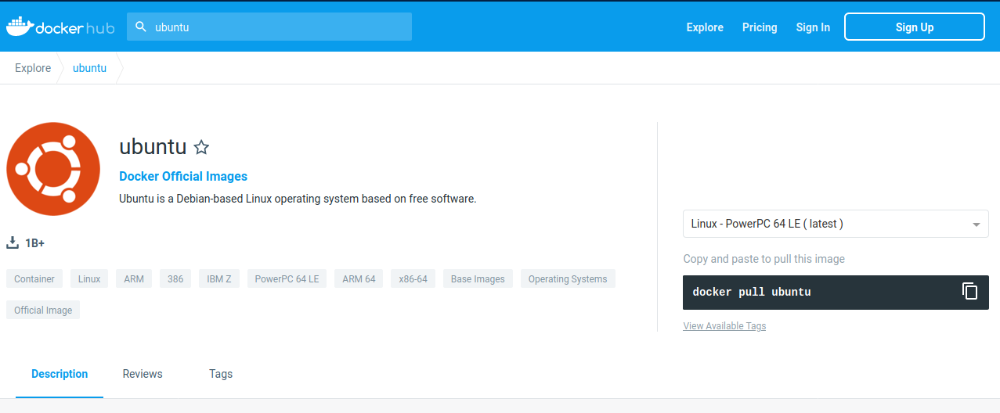

.. _containers-page:

*******************
Containers
*******************

Linux containers
================

What are containers?
---------------------

.. image:: https://www.synopsys.com/blogs/software-security/wp-content/uploads/2022.04/containers-rsa.jpg
  :width: 700

A Container can be seen as a **minimal virtual environment** that can be used in any Linux-compatible machine (and beyond).

Using containers is time- and resource-saving as they allow:

* Controlling for software installation and dependencies.
* Reproducibility of the analysis.

Containers allow us to use **exactly the same versions of the tools**.

Virtual machines or containers ?
----------------------------------

=====================================================  =====================================================
Virtualisation                                         Containerisation (aka lightweight virtualisation)
=====================================================  =====================================================
Abstraction of physical hardware                       Abstraction of application layer
Depends on hypervisor (software)                       Depends on host kernel (OS)
Do not confuse with hardware emulator                  Application and dependencies bundled all together
Enable virtual machines                                Every virtual machine with an OS (Operating System)
=====================================================  =====================================================

Virtual machines vs containers
----------------------------------------

.. image:: https://raw.githubusercontent.com/collabnix/dockerlabs/master/beginners/docker/images/vm-docker5.png
  :width: 800

`Source <https://dockerlabs.collabnix.com/beginners/difference-docker-vm.html>`__


**Pros and cons**

===== ===================================================== =====================================================
ADV   Virtualisation                                        Containerisation
===== ===================================================== =====================================================
PROS. * Very similar to a full OS.     			     * No need of full OS installation (less space).
      * High OS diversity       			     * Better portability
      							     * Faster than virtual machines.
							     * Easier automation.
							     * Easier distribution of recipes.
							     * Better portability.


CONS. * Need more space and resources.                       * Some cases might not be exactly the same as a full OS.
      * Slower than containers.                              * Still less OS diversity, even with current solutions
      * Not that good automation.
===== ===================================================== =====================================================


Docker
======

What is Docker?
-------------------

* Platform for developing, shipping and running applications.
* Infrastructure as application / code.
* First version: 2013.
* Company: originally dotCloud (2010), later named Docker.
* Established `Open Container Initiative <https://www.opencontainers.org/>`__.

As a software:

* `Docker Community Edition <https://www.docker.com/products/container-runtime>`__.
* Docker Enterprise Edition.

There is an increasing number of alternative container technologies and providers. Many of them are actually based on software components originally from the Docker stack and they normally try to address some specific use cases or weakpoints. As a example, **Singularity**, that we introduce later in this couse, is focused in HPC environments. Another case, **Podman**, keeps a high functional compatibility with Docker but with a different focus on technology (not keeping a daemon) and permissions.


Docker components
--------------------

.. image:: http://apachebooster.com/kb/wp-content/uploads/2017/09/docker-architecture.png
  :width: 700

* Read-only templates.
* Containers are run from them.
* Images are not run.
* Images have several layers.

.. image:: https://i.stack.imgur.com/vGuay.png
  :width: 700

Images versus containers
----------------------------

* **Image**: A set of layers, read-only templates, inert.
* An instance of an image is called a **container**.

When you start an image, you have a running container of this image. You can have many running containers of the same image.

*"The image is the recipe, the container is the cake; you can make as many cakes as you like with a given recipe."*

https://stackoverflow.com/questions/23735149/what-is-the-difference-between-a-docker-image-and-a-container


Docker vocabulary
----------------------------

.. code-block:: console

  docker


.. image:: images/docker_vocab.png
  :width: 550

Get help:

.. code-block:: console

  docker run --help


.. image:: images/docker_run_help.png
  :width: 550


Using existing images
---------------------

Explore Docker hub
******************

Images can be stored locally or shared in a registry.


`Docker hub <https://hub.docker.com/>`__ is the main public registry for Docker images.


Let's search the keyword **ubuntu**:



docker pull: import image
*************************

* get latest image / latest release

.. code-block:: console

  docker pull ubuntu


.. image:: images/docker_pull.png
  :width: 650

* choose the version of Ubuntu you are fetching: check the different tags

.. image:: images/dockerhub_ubuntu_1804.png
  :width: 850

.. code-block:: console

  docker pull ubuntu:22.04


Biocontainers
*************

https://biocontainers.pro/

Specific directory of Bioinformatics related entries

* Entries in `Docker hub <https://hub.docker.com/u/biocontainers>`__ and/or `Quay.io <https://quay.io>`__ (RedHat registry)

* Normally created from `Bioconda <https://bioconda.github.io>`__

Example: **FastQC**

https://biocontainers.pro/#/tools/fastqc


.. code-block:: console

    docker pull biocontainers/fastqc:v0.11.9_cv7

docker images: list images
--------------------------

.. code-block:: console

  docker images

.. image:: images/docker_images_list.png
  :width: 650

Each image has a unique **IMAGE ID**.

docker run: run image, i.e. start a container
---------------------------------------------

Now we want to use what is **inside** the image.


**docker run** creates a fresh container (active instance of the image) from a **Docker (static) image**, and runs it.


The format is:

docker run image:tag **command**

.. code-block:: console

  docker run ubuntu:22.04 /bin/ls


.. image:: images/docker_run_ls.png
  :width: 200

Now execute **ls** in your current working directory: is the result the same?


You can execute any program/command that is stored inside the image:

.. code-block:: console

  docker run ubuntu:22.04 /bin/whoami
  docker run ubuntu:22.04 cat /etc/issue


You can either execute programs in the image from the command line (see above) or **execute a container interactively**, i.e. **"enter"** the container.

.. code-block:: console

  docker run -it ubuntu:22.04 /bin/bash


Run container as daemon (in background)

.. code-block:: console

  docker run -ti --detach ubuntu:22.04

  docker run --detach ubuntu:22.04 tail -f /dev/null
  

Run container as daemon (in background) with a given name

.. code-block:: console

  docker run -ti --detach --name myubuntu ubuntu:22.04

  docker run --detach --name myubuntu ubuntu:22.04 tail -f /dev/null


docker ps: check containers status
----------------------------------

List running containers:

.. code-block:: console

  docker ps


List all containers (whether they are running or not):

.. code-block:: console

  docker ps -a


Each container has a unique ID.

docker exec: execute process in running container
-------------------------------------------------

.. code-block:: console

  docker exec myubuntu uname -a


* Interactively

.. code-block:: console

  docker exec -it myubuntu /bin/bash


docker stop, start, restart: actions on container
-------------------------------------------------

Stop a running container:

.. code-block:: console

  docker stop myubuntu

  docker ps -a


Start a stopped container (does NOT create a new one):

.. code-block:: console

  docker start myubuntu

  docker ps -a


Restart a running container:

.. code-block:: console

  docker restart myubuntu

  docker ps -a


Run with restart enabled

.. code-block:: console

  docker run --restart=unless-stopped --detach --name myubuntu2 ubuntu:22.04 tail -f /dev/null

* Restart policies: no (default), always, on-failure, unless-stopped

Update restart policy

.. code-block:: console

  docker update --restart unless-stopped myubuntu


docker rm, docker rmi: clean up!
--------------------------------

.. code-block:: console

  docker rm myubuntu
  docker rm -f myubuntu


.. code-block:: console

  docker rmi ubuntu:22.04


Major clean
***********

Check used space

.. code-block:: console

  docker system df


Remove unused containers (and others) - **DO WITH CARE**

.. code-block:: console

  docker system prune


Remove ALL non-running containers, images, etc. - **DO WITH MUCH MORE CARE!!!**

.. code-block:: console

  docker system prune -a

* Reference: https://www.digitalocean.com/community/tutorials/how-to-remove-docker-images-containers-and-volumes


Volumes
-------

Docker containers are fully isolated. It is necessary to mount volumes in order to handle input/output files.

Syntax: **\--volume/-v** *host:container*

.. code-block:: console

  mkdir data
  touch data/test
  # We can also copy the FASTQ we used in previous exercises... cp ...
  docker run --detach --volume $(pwd)/data:/scratch --name fastqc_container biocontainers/fastqc:v0.11.9_cv7 tail -f /dev/null
  docker exec -ti fastqc_container /bin/bash
  > ls -l /scratch
  # We can also run fastqc from here
  > cd /scratch; fastqc SRR6466185_1.fastq.gz 
  > exit


Docker recipes: build your own images
=====================================

OS commands in image building
-----------------------------

Depending on the underlying OS, there are different ways to build images.

Know your base system and their packages. Popular ones:

* `Debian <https://packages.debian.org>`__

* `CentOS <https://centos.pkgs.org/>`__

* `Alpine <https://pkgs.alpinelinux.org/packages>`__

* Conda. `Anaconda <https://anaconda.org/anaconda/repo>`__, `Conda-forge <https://conda-forge.org/feedstocks/>`__, `Bioconda <https://anaconda.org/bioconda/repo>`__, etc.


Update and upgrade packages
***************************

* In **Ubuntu**:

.. code-block::

  apt-get update && apt-get upgrade -y


In **CentOS**:

.. code-block::

  yum check-update && yum update -y


Search and install packages
***************************

* In **Ubuntu**:

.. code-block::

  apt search libxml2
  apt install -y libxml2-dev


* In **CentOS**:

.. code-block::

  yum search libxml2
  yum install -y libxml2-devel.x86_64


Note the **-y** option that we set for updating and for installing.<br>
It is an important option in the context of Docker: it means that you *answer yes to all questions* regarding installation.


Building recipes
----------------

All commands should be saved in a text file, named by default **Dockerfile**.

Basic instructions
******************

Each row in the recipe corresponds to a **layer** of the final image.

**FROM**: parent image. Typically, an operating system. The **base layer**.

.. code-block::

  FROM ubuntu:22.04


**RUN**: the command to execute inside the image filesystem.

Think about it this way: every **RUN** line is essentially what you would run to install programs on a freshly installed Ubuntu OS.

.. code-block::
  RUN apt install wget


A basic recipe:

.. code-block::

  FROM ubuntu:22.04

  RUN apt update && apt -y upgrade
  RUN apt install -y wget


docker build
************

Implicitely looks for a **Dockerfile** file in the current directory:

.. code-block:: console

  docker build .

Same as:

.. code-block:: console

  docker build --file Dockerfile .


Syntax: **\--file / -f**

**.** stands for the context (in this case, current directory) of the build process. This makes sense if copying files from filesystem, for instance. **IMPORTANT**: Avoid contexts (directories) overpopulated with files (even if not actually used in the recipe).

You can define a specific name for the image during the build process.

Syntax: **-t** *imagename:tag*. If not defined ```:tag``` default is latest.

.. code-block:: console

  docker build -t mytestimage .
  # Same as:
  docker build -t mytestimage:latest .


* IMPORTANT: Avoid contexts (directories) over-populated with files (even if not actually used in the recipe).
In order to avoid that some directories or files are inspected or included (e.g, with COPY command in Dockerfile), you can use .dockerignore file to specify which paths should be avoided. More information at: https://codefresh.io/docker-tutorial/not-ignore-dockerignore-2/


The last line of installation should be **Successfully built ...**: then you are good to go.

Check with ``docker images`` that you see the newly built image in the list...

Then let's check the ID of the image and run it!

.. code-block:: console

  docker images

  docker run f9f41698e2f8
  docker run mytestimage


More instructions
*****************

**WORKDIR**: all subsequent actions will be executed in that working directory

.. code-block::

  WORKDIR ~

**ADD, COPY**: add files to the image filesystem

Difference between ADD and COPY explained `here <https://stackoverflow.com/questions/24958140/what-is-the-difference-between-the-copy-and-add-commands-in-a-dockerfile>`__ and `here <https://nickjanetakis.com/blog/docker-tip-2-the-difference-between-copy-and-add-in-a-dockerile>`__

**COPY**: lets you copy a local file or directory from your host (the machine from which you are building the image)

**ADD**: same, but ADD works also for URLs, and for .tar archives that will be automatically extracted upon being copied.

**ENV, ARG**: run and build environment variables

Difference between ARG and ENV explained `here <https://vsupalov.com/docker-arg-vs-env/>`__.

* **ARG** values: available only while the image is built.
* **ENV** values: available during the image build process but also for the future running containers.
  * It can be checked in a resulting running container by running ``env``.

**CMD, ENTRYPOINT**: command to execute when generated container starts

The ENTRYPOINT specifies a command that will always be executed when the container starts. The CMD specifies arguments that will be fed to the ENTRYPOINT

In the example below, when the container is run without an argument, it will execute `echo "hello world"`.
If it is run with the argument **hello moon** it will execute `echo "hello moon"`

.. code-block::

  FROM ubuntu:22.04
  ENTRYPOINT ["/bin/echo"]
  CMD ["hello world"]


A more complex recipe (save it in a text file named **Dockerfile**:

.. code-block::

  FROM ubuntu:22.04

  MAINTAINER Toni Hermoso Pulido <toni.hermoso@crg.eu>

  WORKDIR ~

  RUN apt-get update && apt-get -y upgrade
  RUN apt-get install -y wget

  ENTRYPOINT ["/usr/bin/wget"]
  CMD ["https://cdn.wp.nginx.com/wp-content/uploads/2016/07/docker-swarm-hero2.png"]


.. code-block:: console

  docker run f9f41698e2f8 https://cdn-images-1.medium.com/max/1600/1*_NQN6_YnxS29m8vFzWYlEg.png


docker tag
-----------

To tag a local image with ID "e23aaea5dff1" into the "ubuntu_wget" image name repository with version "1.0":

.. code-block:: console

  docker tag e23aaea5dff1 ubuntu_wget:1.0


Build exercise
--------------

* Random numbers

* Copy the following short bash script in a file called random_numbers.bash.

.. code-block:: console

  #!/usr/bin/bash
  seq 1 1000 | shuf | head -$1


This script outputs random intergers from 1 to 1000: the number of integers selected is given as the first argument.

* Write a recipe for an image:

  * Based on centos:7

  * That will execute this script (with bash) when it is run, giving it 2 as a default argument (i.e. outputs 2 random integers): the default can be changed as the image is run.

  * Build the image.

  * Start a container with the default argument, then try it with another argument.

.. raw:: html

  <details>
  <summary><a>Suggested solution</a></summary>

.. code-block::

  FROM centos:7

  # Copy script from host to image
  COPY random_numbers.bash .

  # Make script executable
  RUN chmod +x random_numbers.bash

  # As the container starts, "random_numbers.bash" is run
  ENTRYPOINT ["/usr/bin/bash", "random_numbers.bash"]

  # default argument (that can be changed on the command line)
  CMD ["2"]

Build and run:

.. code-block:: console

  docker build -f Dockerfile_RN -t random_numbers .
  docker run random_numbers
  docker run random_numbers 10

.. raw:: html

  </details>

Additional commands
===================

* **docker inspect**: Get details from containers (both running and stopped). Things such as IPs, volumes, etc.

* **docker logs**: Get *console* messages from running containers. Useful when using with web services.

* **docker commit**: Turn a container into an image. It make senses to use when modifying container interactively. However this is bad for reproducibility if no steps are saved.

Good for long-term reproducibility and for critical production environments:


* **docker save**: Save an image into an image tar archive.

* **docker load**: Load an image tar archive to become an image.

* **docker export**: Save a container filesystem into a tar archive.

* **docker import**: Import a filesystem tar archive into an image (you need to specify a target tag).


Singularity
===========


* Focus:
	* Reproducibility to scientific computing and the high-performance computing (HPC) world.
* Origin: Lawrence Berkeley National Laboratory. Later spin-off: Sylabs
* Version 1.0 -> 2016
* More information: `https://en.wikipedia.org/wiki/Singularity_(software) <https://en.wikipedia.org/wiki/Singularity_(software)>`__

Singularity architecture
---------------------------

.. image:: images/singularity_architecture.png
  :width: 800


===================================================== =====================================================
Strengths                                             Weaknesses
===================================================== =====================================================
No dependency of a daemon                             At the time of writing only good support in Linux
Can be run as a simple user                           Mac experimental. Desktop edition. Only running
Avoids permission headaches and hacks                 For some features you need root account (or sudo)
Image/container is a file (or directory)
More easily portable

Two types of images: Read-only (production)
Writable (development, via sandbox)

===================================================== =====================================================

**Trivia**

Nowadays, there may be some confusion since there are two projects:

* `Apptainer Singularity <https://github.com/apptainer/singularity>`__
* `Sylabs Singularity <https://sylabs.io/singularity/>`__

They "forked" in 2021. So far they share most of the codebase, but eventually this could be different, and software might have different functionality.

The former is already "End Of Life" and its development continues named as `Apptainer <http://apptainer.org/>`_, under the support of the Linux Foundation.

Container registries
--------------------

Container images, normally different versions of them, are stored in container repositories.

These repositories can be browser or discovered within, normally public, container registries.

Docker hub
**********

It is the first and most popular public container registry (which provides also private repositories).

* `Docker Hub <https://hub.docker.com>`__

Example:

`https://hub.docker.com/r/biocontainers/fastqc <https://hub.docker.com/r/biocontainers/fastqc>`__

.. code-block:: console

	singularity build fastqc-0.11.9_cv7.sif docker://biocontainers/fastqc:v0.11.9_cv7


Biocontainers
*************

* `Biocontainers <https://biocontainers.pro>`__

Website gathering Bioinformatics focused container images from different registries.

Originally Docker Hub was used, but now other registries are preferred.

Example: `https://biocontainers.pro/tools/fastqc <https://biocontainers.pro/tools/fastqc>`__

**Via quay.io**

`https://quay.io/repository/biocontainers/fastqc <https://quay.io/repository/biocontainers/fastqc>`__

.. code-block:: console

	singularity build fastqc-0.11.9.sif docker://quay.io/biocontainers/fastqc:0.11.9--0


**Via Galaxy project prebuilt images**

.. code-block:: console

	singularity pull --name fastqc-0.11.9.sif https://depot.galaxyproject.org/singularity/fastqc:0.11.9--0


Galaxy project provides all Bioinformatics software from the BioContainers initiative as Singularity prebuilt images. If download and conversion time of images is an issue, this might be the best option for those working in the biomedical field.

Link: https://depot.galaxyproject.org/singularity/

Running and executing containers
--------------------------------

Once we have some image files (or directories) ready, we can run processes.

Singularity shell
*****************

The straight-forward exploratory approach is equivalent to ``docker run -ti biocontainers/fastqc:v0.11.9_cv7 /bin/shell`` but with a more handy syntax.

.. code-block:: console

	singularity shell fastqc-0.11.9.sif


Move around the directories and notice how the isolation approach is different in comparison to Docker. You can access most of the host filesystem.

Singularity exec
****************

That is the most common way to execute Singularity (equivalent to ``docker exec``). That would be the normal approach in a HPC environment.

.. code-block:: console

    singularity exec fastqc-0.11.9.sif fastqc

a processing of a FASTQ file from *data* directory:

.. code-block:: console

    singularity exec fastqc-0.11.9_cv7.sif fastqc SRR6466185_1.fastq.gz


Singularity run
***************

This executes runscript from recipe definition (equivalent to ``docker run``). Not so common for HPC uses. More common for instances (servers).

.. code-block:: console

    singularity run fastqc-0.11.9.sif


Environment control
*******************

By default Singularity inherits a profile environment (e.g., PATH environment variable). This may be convenient in some circumstances, but it can also lead to unexpected problems when your own environment clashes with the default one from the image.

.. code-block:: console

    singularity shell -e fastqc-0.11.9.sif
    singularity exec -e fastqc-0.11.9.sif fastqc
    singularity run -e fastqc-0.11.9.sif


Compare ``env`` command with and without -e modifier.

.. code-block:: console

    singularity exec fastqc-0.11.9.sif env
    singularity exec -e fastqc-0.11.9.sif env

Exercise
********

Using the 2 fastq available files, process them outside and inside a mounted directory using fastqc.

.. raw:: html

   <details>
   <summary><a>Suggested solution</a></summary>


.. code-block:: console

	# Let's create a dummy directory
	mkdir data

	# Let's copy contents of data in that directory

	singularity exec fastqc.sif fastqc data/*fastq.gz

	# Check you have some HTMLs there. Remove them
	rm data/*html

	# Let's use shell
	singularity shell fastqc.sif
	> cd data
	> fastqc *fastq.gz
	> exit

	# Check you have some HTMLs there. Remove them
	singularity exec -B ./data:/scratch fastqc.sif fastqc /scratch/*fastq.gz

	# What happens here!
	singularity exec -B ./data:/scratch fastqc.sif bash -c 'fastqc /scratch/*fastq.gz'

.. raw:: html

  </details>

